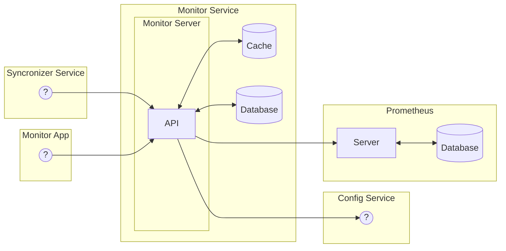

## Motivação

Há ao menos três desafios principais no que tange garantir a integridade dos dados sincronizados entre aplicações:
1. Ser reativo à indisponibilidade de sistemas de terceiros.
1. Garantir a consistência dos dados.
1. Metrificar quantitativamente e qualitativamente as operações realizadas durante a sincronia.

Faz-se assim necessário um sistema que observe os sistemas integradores e entregue essas métricas para os três usuários principais:
- O time da RWS, principalmente representado com Tecnologia.
- O cliente do varejo.
- O parceiro integrador.

## Escopos do projeto

### v1.x.x
Criação da primeira versão viável de um sistema que atenda as necessidades de monitoramento passivo para o front-end que os três usuários especificados usarão.

1. Criação e manutenção do Prometheus.
2. Desenvolvimento do projeto em NestJS.

### v2.x.x
Adição do escopo de monitoramento ativo. 

3. Bate cadastral

## Arquitetura

### Prometheus

O Prometheus é um sistema de monitoramento de código aberto e um sistema de séries temporais que coleta métricas de sistemas e serviços, armazena-as e as torna disponíveis por meio de uma poderosa consulta de linguagem de consulta.

### NestJS

NestJS é um framework para construção de aplicativos eficientes, confiáveis e escaláveis em Node.js. Ele usa JavaScript e é construído com TypeScript.

### Topologia Sugerida

## Planejamento

### v1.x.x

Estimativa inicial de 108h para a primeira versão do projeto.

| # | Escopo | Responsável | Carga | Atividade | Pré-requisitos | 
| :---  | :---: | :---: | :---: | :--- | :--- |
| 1. | <b>AWS</b> | - | - | - | |
| 1.1. | AWS | ? | ? | Acessos ou build automática | |
| 1.2. | AWS | ? | ? | Configurar ECR para Prometheus | |
| 1.3. | AWS | ? | ? | Configurar ECR para Monitor | |
| 1.4. | AWS | ? | ? | Configurar RDS para Monitor | |
| 2. | <b>Github</b> | - | - | - | |
| 2.1. | Github | ? | ? | Criação de repositório para o Prometheus | |
| 2.2. | Github | ? | ? | Criação de repositório para o serviço de monitoramento | |
| 2.3. | Github | ? | 2 ~ 10h | Criação de workflow de build automática | |
| 3. | <b>Prometheus</b> | - | - | - | <b>1, 2</b> |
| 3.1. | Prometheus | Filipe | 4h | Configurar um repositório para build do container Prometheus | |
| 3.2. | Prometheus | Filipe | 4h | Configurar IaC do container Prometheus como AWS ECS Fargate | |
| 3.3. | Prometheus | Filipe | 4h | Configurar scrapper do Prometheus | 4.2 |
| 4. | <b>Monitor</b> | - | - | - | <b>1, 2</b> |
| 4.1. | Monitor | Filipe | 6h | Configuração do Projeto: ambiente local com docker-compose, Nestjs, conexão com Postgres e Prometheus | |
| 4.2. | Monitor | Filipe | 6h | Configuração do gerador de documentação OpenAPI 3.1, [documentação](https://docs.nestjs.com/openapi/introduction) | |
| 4.3. | Monitor | Filipe | 8h | Configuração de métricas custom para exportar para Prometheus | |
| 4.4. | Monitor | Filipe | 2h | Endpoint de exportação de métricas para Prometheus scrap | |
| 4.5. | Monitor | Filipe | 8h | Repositórios de recursos e integração com banco | |
| 4.6. | Monitor | Filipe | 8h | Webhook de captura de métricas de systemas | |
| 4.7. | Monitor | Filipe | 8h | Webhook de captura de métricas de conexões | |
| 4.8. | Monitor | Filipe | 20h | Endpoints de listagem e métricas de Providers  | |
| 4.9. | Monitor | Filipe | 20h | Endpoints de listagem e métricas de Conexões | |

## Requisitos Funcionais

### RF1 - Coleta de métricas de Providers
- O sistema deve ser capaz de coletar métricas de sistemas integradores.
- São elas:
    - request_response_time
    - request_success
    - request_total
    - request_error_500
    - request_error_400

### RF2 - Coleta de métricas de Connection 
- O sistema deve ser capaz de coletar métricas de conexões entre sistemas.
- São elas:
    - resource_index_time
    - resource_get_time
    - resource_create_time
    - resource_update_time
    - resource_delete_time

### RF3 - Exportação de métricas
- O sistema deve exportar as métricas acumuladas para o Prometheus.
- O endpoint default para o Prometheus é `/metrics`.

### RF4 - Sistema deve acumular métricas sobre Providers
- O sistema deve trazer para cada Provider:
  - trazer cada métrica de Provider uma timeserie condicionada a um intervalo de tempo.

### RF5 - Sistema deve acumular métricas sobre Conexões
- O sistema deve trazer para cada Provider:
  - trazer cada métrica de Provider uma timeserie condicionada a um intervalo de tempo.
