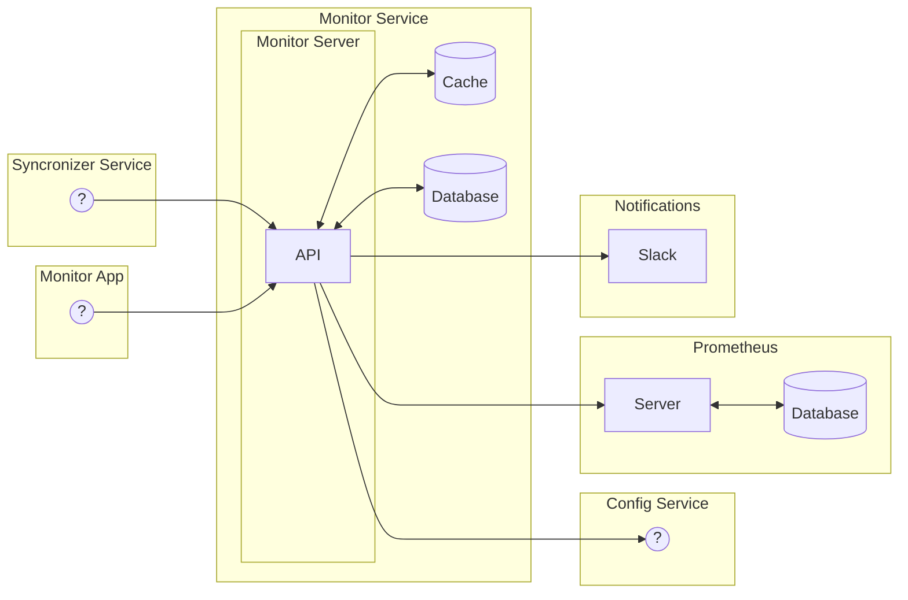

## Motivação

Há ao menos três desafios principais no que tange garantir a integridade dos dados sincronizados entre aplicações:
1. Ser reativo à indisponibilidade de sistemas de terceiros.
1. Garantir a consistência dos dados.
1. Metrificar quantitativamente e qualitativamente as operações realizadas durante a sincronia.

Faz-se assim necessário um sistema que observe os sistemas integradores e entregue essas métricas para os três usuários principais:
- O time da RWS, principalmente representado com Tecnologia.
- O cliente do varejo.
- O parceiro integrador.

## Escopos do projeto

### v1.x.x
Criação da primeira versão viável de um sistema que atenda as necessidades de monitoramento passivo para o front-end que os três usuários especificados usarão.

1. Criação e manutenção do Prometheus.
2. Desenvolvimento do projeto em NestJS.

### v2.x.x
Adição do escopo de monitoramento ativo. 

3. Bate cadastral

## Arquitetura

### Prometheus

O Prometheus é um sistema de monitoramento de código aberto e um sistema de séries temporais que coleta métricas de sistemas e serviços, armazena-as e as torna disponíveis por meio de uma poderosa consulta de linguagem de consulta.

### NestJS

NestJS é um framework para construção de aplicativos eficientes, confiáveis e escaláveis em Node.js. Ele usa JavaScript e é construído com TypeScript.

### Topologia Sugerida

## Requisitos Funcionais

### v1.x.x

#### RF1 - O serviço deve ser capaz de acumular métricas
- No boot do serviço, deve ser possível configurar o Prometheus para coletar métricas do serviço.
Para acumularemos métricas, devemos usar um banco de dados que suporte séries temporais. O Prometheus é um banco de dados de séries temporais que suporta a coleta de métricas de sistemas e serviços.

#### RF2 - O serviço deve acumular métricas de forma a agrupar e filtrar por critérios
- Devemos usar as labels do prometheus para agrupar e filtrar as métricas. O objetivo está em conseguir disponibilizar valores de métricas para cada Provider e Connection, como também o somatório de todas as métricas com filtros maiores.

Exs:
- Média de requisições de update entre SistemaA e SistemaB.
- Média de todas as requisições de update com o destino para SistemaA independente de qual origem.

#### RF3 - Coleta de métricas de sistemas integrados
- O sistema deve disponibilizar um webhook capaz de coletar métricas de Providers.
- São elas:
    - request_response_time
    - request_success
    - request_total
    - request_error_4xx
    - request_error_404
    - request_error_429
    - request_error_5xx

#### RF4 - Coleta de métricas sobre conexões entre sistemas
- O sistema deve disponibilizar um webhook capaz de coletar métricas de Connections.
- São elas:
    - resource_index_time
    - resource_get_time
    - resource_create_time
    - resource_update_time
    - resource_delete_time

#### RF5 - Exportação de métricas
- O sistema deve exportar as métricas acumuladas para o Prometheus.
- O endpoint default para o Prometheus é `/metrics`.

#### RF6 - Sistema deve interpretar métricas sobre Providers
- Ao ser requisitado, o serviço deve agrupar métricas sobre um Provider e retornar uma timeserie condicionada a um intervalo de tempo.
- O intervalo de tempo deve ser configurável.
- Os filtros de métricas deverão ser injetados através das labels para o Prometheus.

Ex:
- Dado Provider ID=X e interval=Y:
    - Para cada métrica de Provider:
      - uma timeserie agrupada por X e Y.
    - trazer cada métrica de Connections:
      - uma timeserie agrupada por X e Y na qual o Provider seja origem.
      - uma timeserie agrupada por X e Y na qual o Provider seja destino.

#### RF7 - Sistema deve acumular métricas sobre Conexões
- Ao ser requisitado, o serviço deve agrupar métricas sobre uma Connection e retornar uma timeserie condicionada a um intervalo de tempo.
- O intervalo de tempo deve ser configurável.
- Os filtros de métricas deverão ser injetados através das labels para o Prometheus.

Ex:
- Dado Connection ID=X e interval=Y:
    - Para cada métrica de Connection:
      - uma timeserie agrupada por X e Y.

## Planejamento

### v1.x.x

Estimativa inicial de 118h para a primeira versão do projeto.

| # | Escopo | Responsável | Carga | Atividade | Pré-requisitos | 
| :---  | :---: | :---: | :---: | :--- | :--- |
| 1. | <b>AWS</b> | - | - | - | |
| 1.1. | AWS | ? | ? | Acessos ou build automática | |
| 1.2. | AWS | ? | ? | Configurar ECR para Prometheus | |
| 1.3. | AWS | ? | ? | Configurar ECR para Monitor | |
| 1.4. | AWS | ? | ? | Configurar RDS para Monitor | |
| 2. | <b>Github</b> | - | - | - | |
| 2.1. | Github | ? | ? | Criação de repositório para o Prometheus | |
| 2.2. | Github | ? | ? | Criação de repositório para o serviço de monitoramento | |
| 2.3. | Github | ? | 2 ~ 16h | Criação de workflow de build automática | |
| 3. | <b>Prometheus</b> | - | - | - | <b>1, 2</b> |
| 3.1. | Prometheus | Filipe | 4h | Configurar um repositório para build do container Prometheus | |
| 3.2. | Prometheus | Filipe | 4h | Configurar IaC do container Prometheus como AWS ECS Fargate | |
| 3.3. | Prometheus | Filipe | 4h | Configurar scrapper do Prometheus | 4.2 |
| 4. | <b>Monitor</b> | - | - | - | <b>1, 2</b> |
| 4.1. | Monitor | Filipe | 4h | Configuração do Projeto: ambiente local com docker-compose, Nestjs, conexão com Postgres e Prometheus | |
| 4.2. | Monitor | Filipe | 4h | Configuração do gerador de documentação OpenAPI 3.1, [documentação](https://docs.nestjs.com/openapi/introduction) | |
| 4.3. | Monitor | Filipe | 8h | RF1 - O serviço deve ser capaz de acumular métricas | |
| 4.4. | Monitor | Filipe | 8h | RF2 - O serviço deve acumular métricas de forma a agrupar e filtrar por critérios | |
| 4.5. | Monitor | Filipe | 8h | RF3 - Coleta de métricas de sistemas integrados | |
| 4.6. | Monitor | Filipe | 8h | RF4 - Coleta de métricas sobre conexões entre sistemas | |
| 4.7. | Monitor | Filipe | 2h | RF5 - Exportação de métricas | |
| 4.8. | Monitor | Filipe | 24h | RF6 - Sistema deve interpretar métricas sobre Providers  | |
| 4.9. | Monitor | Filipe | 24h | RF7 - Sistema deve acumular métricas sobre Conexões | |
